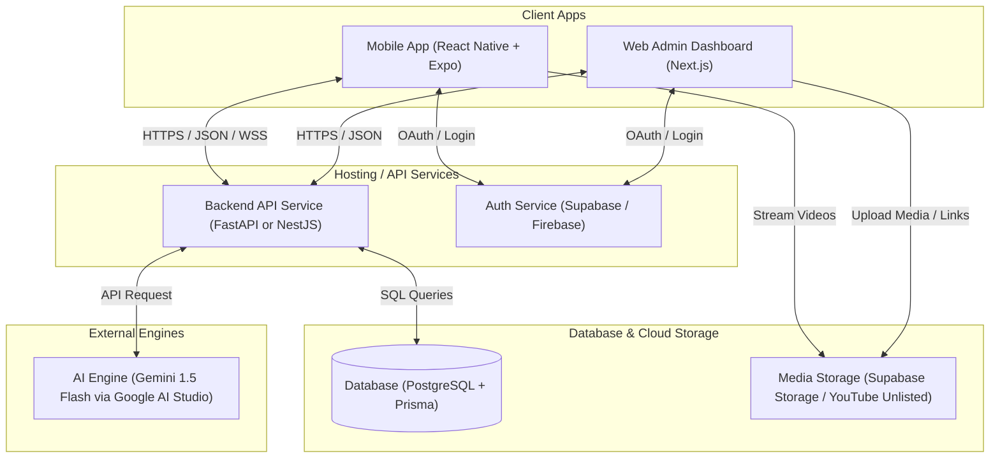
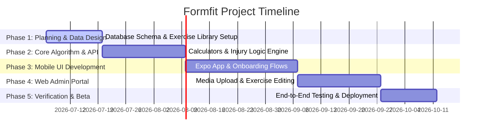

# Formfit: Master Project Plan & Proposal

This document serves as the master blueprint for **Formfit**, an intelligent, scientifically-backed fitness and nutrition platform. It compiles all requirements, tech stack recommendations, architectural designs, features, and phase-by-phase implementation plans.

---

## 1. Executive Summary & Problem Statement

In modern gyms, gym-goers face three major hurdles:
* **Trainer Inconsistency:** A gym might have several trainers on shift. Every time a user approaches a different trainer, the workout advice, form tips, and methodology change, leading to confusion and slowed progress.
* **Gym-Floor Anxiety:** Many beginners (particularly women or self-conscious lifters) do not feel comfortable asking trainers for guidance. Instead, they struggle with machine setups or copy incorrect forms, which can lead to injury.
* **Lack of True Customization:** Standard training plans fail to adapt to a user's daily mental state, minor joint pains, specific past injuries, or dietary constraints.

**Formfit** solves this by acting as a **Universal, Solo Virtual Trainer** accessible directly on the gym floor through a portable mobile app, powered by scientific rules and optional AI personalization.

---

## 2. Platform Architecture & Block Diagram

The system uses a **Monorepo** structure where all code sits in a single repository, making it easy for a team of 4 to share types, database schemas, and coordinate updates.

### System Architecture Block Diagram


---

## 3. Core App Features

### A. Scientific Workout Engine
* **Dynamic Injury Classification Matrix:**
  * *Level 1 (Minor Soreness / Joint Pain / Small Recovered Fractures):* The engine dynamically swaps out movements that strain the affected joint. E.g., swapping a Barbell Back Squat with a Leg Press or Goblet Squat.
  * *Level 2 (Severe / Acute Injuries):* The engine locks workouts for the affected area and displays a prominent disclaimer advising the user to seek physical therapy.
* **Daily Auto-Regulation (Mental & Physical Readiness):**
  * Before starting a workout, the user answers 3 quick sliders: Sleep Quality, Soreness, and Stress/Energy.
  * If the scores are low, the engine automatically reduces training volume (sets/reps) or intensity (target weights) for that day to prevent injury.
* **Scientific Progression:**
  * Automatically implements progressive overload week-to-week (increasing volume, adjusting reps, or altering tempo).
  * Tracks weekly set volume per muscle group to prevent muscle imbalances (e.g., balancing push vs. pull movements).

### B. Personalized Nutrition Engine
* **TDEE & Macro Calculator:**
  * Uses the Mifflin-St Jeor equation to compute maintenance calories based on age, gender, height, weight, and activity level.
  * Automatically deducts calories for weight loss (e.g., -500 kcal) or adds for muscle gain (e.g., +300 kcal).
  * Distributes macronutrients (protein, carbs, fats) to support weight lifting recovery.
* **Custom Diet Planner:**
  * Filters recipes by user preferences (Vegetarian, Vegan, Non-Veg, Pescatarian) and allergen profiles.
  * Generates daily meal ideas matching the exact calculated targets.
  * **AI Meal Swap:** Allows users to input custom requests (e.g., *"What high-protein meal can I make in 10 minutes with eggs and spinach?"*) and generates a customized recipe that fits their target macros.

### C. Self-Guided Gym Experience
* **Discreet Workout Companion:**
  * Visual looping video/photo demonstrations for exercises.
  * No-shame instructions on how to set up gym machines, resolving the barrier for beginners who feel self-conscious.
  * Interactive logs to record weight, reps, and set rest timers.

---

## 4. The Tech Stack Decisions

To support a team of 4 and keep development costs at zero, the plan presents two pathways: the **Zero-Cost Student Stack** (for development/testing) and the **Commercial Stack** (for scaling).

| Layer | Option A: Zero-Cost Student Stack (Recommended for Beta) | Option B: Production / Commercial Scale |
| :--- | :--- | :--- |
| **Mobile App** | **React Native + Expo** (Free tools, test on personal phones via Expo Go for free) | **React Native / Flutter** (App Store Account: $99/yr, Google Play: $25 one-time) |
| **Admin Web Portal** | **Next.js hosted on Vercel** (Vercel Hobby Tier is $0/month) | **Next.js hosted on AWS Amplify or Vercel Pro** ($20+/month) |
| **Backend API** | **Vercel Serverless Functions** or **Render Free Tier** ($0/month) | **FastAPI (Python) or NestJS on Render/AWS ECS** ($7 - $50+/month) |
| **Database & Auth** | **Supabase Free Tier** ($0/month for 500MB database, 50k monthly active users) | **Supabase Pro Tier** ($25/month) or **Amazon RDS PostgreSQL** |
| **Exercise Media Storage** | **YouTube Unlisted Hack** (Host videos as unlisted on YouTube and embed them in-app for $0 unlimited bandwidth) | **Cloudinary or AWS S3 + CloudFront CDN** (Billed by storage & streaming bandwidth) |
| **AI Personalization** | **Gemini 1.5 Flash via Google AI Studio** (Free up to 15 Requests Per Minute) | **Gemini Enterprise API or OpenAI API** (Pay-per-token pricing) |

---

## 5. Development Monorepo Structure

For your team of 4, the repository should be structured as follows:

```text
Formfit/ (Git Repository Root)
├── mobile/             # React Native + Expo Project (Developer A)
├── web/                # Next.js Admin Dashboard (Developer C)
├── backend/            # FastAPI or NestJS Server (Developer B)
├── shared/             # Shared Types, Models, and Constants (Shared by all)
│   ├── types/          # TypeScript interfaces (API Request/Response schemas)
│   └── constants/      # Injury mapping lists, basic exercises database
├── package.json        # Workspace configuration
└── README.md           # Setup and running instructions
```

---

## 6. Detailed Implementation Phases

We recommend dividing the project into **5 sequential phases** over approximately 14 weeks.



### Phase 1: Planning, Schema & Core Data Design (Weeks 1–2)
* **Goal:** Set up the Monorepo and outline the exact list of exercises, muscle groups, and injury mappings.
* **Tasks:**
  * Initialize the Monorepo directory and set up Git.
  * Design the PostgreSQL database schema (Tables: Users, ExerciseLibrary, WorkoutLogs, DailyReadiness, Recipes, SavedMealPlans).
  * Pre-populate a static base list of ~150 core exercises (Squat, Bench Press, Lat Pulldown, etc.) with target muscles.
  * Map injury labels to muscle zones (e.g., "Knee Pain" maps to Quadriceps-dominant movements).

### Phase 2: Core Personalization Algorithm & Backend (Weeks 3–5)
* **Goal:** Build the math, rules, and AI integration for workout and nutrition generation.
* **Tasks:**
  * Create the TDEE and Macro distribution calculators in the backend.
  * Build the Heuristic Rule Engine for exercise substitutions (excluding movements based on injury tags).
  * Integrate the **Gemini 1.5 Flash API** to handle conversational recipe requests ("Swap Meal" feature).
  * Build the endpoints for user profile creation, daily readiness check-in, and workout logging.

### Phase 3: Mobile App Frontend Development (Weeks 6–9)
* **Goal:** Build the React Native application using Expo and connect it to the backend.
* **Tasks:**
  * Create onboarding screens (asking for age, gender, height, weight, injuries, goals).
  * Build the Dashboard (showing the current day's workout and meal plan).
  * Build the Workout Logger (clean UI for logging sets, reps, and viewing exercise guide videos).
  * Implement local video caching so videos play instantly in the gym without cellular lagging.
  * Connect state management (Zustand) and integrate backend APIs.

### Phase 4: Web Admin Portal & Media Management (Weeks 10–12)
* **Goal:** Build the portal where the team can manage exercises, foods, and upload video links.
* **Tasks:**
  * Create a secure Next.js web application for admins.
  * Build a list view of all exercises in the database.
  * Add the ability to edit descriptions, select primary muscles, and paste custom YouTube Unlisted demonstration links.
  * Connect the media manager to update the database, instantly syncing changes to the mobile app.

### Phase 5: Verification, Integration & Beta Testing (Weeks 13–14)
* **Goal:** Test the application end-to-end with real users and verify safety rules.
* **Tasks:**
  * Deploy the backend to Vercel/Render (Free Tier) and the database to Supabase.
  * Distribute the mobile app to the team of 4 and 10 external beta testers using **Expo Go** or **TestFlight/Firebase App Distribution**.
  * Run test cases mimicking extreme user profiles (e.g., severe injuries, strict allergies) to confirm the engine behaves safely.
  * Gather feedback on UI design, gym usability, and adjust.
