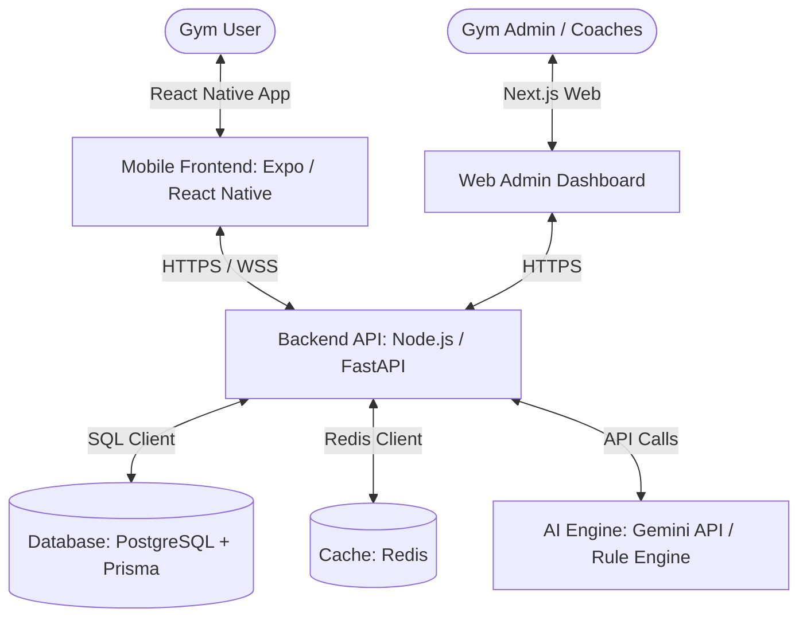

# Formfit Implementation Plan

A comprehensive proposal for **Formfit**, an intelligent, scientifically-backed fitness and nutrition platform designed to solve gym-floor anxiety, trainer inconsistency, and personalized client adaptation.

---

## 1. App vs. Web: Detailed Evaluation

To address the core problem (gym-goers facing inconsistent training advice and feeling uncomfortable asking trainers on the gym floor), the platform must be accessible **directly during a workout**.

| Platform | Pros | Cons | Recommendation |
| :--- | :--- | :--- | :--- |
| **Mobile App** (React Native / Flutter) | - **Portable**: Used on the gym floor. - **Camera Access**: Scan machine QR codes for guides. - **Sensors/Integrations**: Syncs with Apple Health / Google Fit. - **Engagement**: Push notifications for workouts, meals, water. - **Offline Mode**: Works in areas with poor gym Wi-Fi. | - Higher initial development effort. - App store approval cycles. | **Primary Platform (100% Recommended)**. A mobile app is essential for in-gym utility, tracking, and real-time exercise adaptation. |
| **Web App** (React/Next.js) | - **Zero Install**: Low friction for first-time onboarding. - **Admin Dashboard**: Easy tool for gym owners or premium coaches. - **Content Consumption**: Easier to read detailed meal plans/recipes on desktop. | - Harder to use actively while lifting. - No native push notifications on iOS. | **Secondary Platform**. Recommended for a landing page, user onboarding, and a potential Admin Dashboard for gym administrators. |

### Proposed Approach
We will build **Formfit** as a **cross-platform Mobile App** (using React Native with Expo) for users, paired with a lightweight **Web Backend & Dashboard** (Next.js) for database management, content entry, and optional trainer monitoring.

---

## 2. Core Features & Scientific Foundation

### A. The Scientific Workout Engine (Customization & Periodization)
1. **Dynamic Injury Mapping & Classification**:
   - A logic matrix that links injuries to affected joints and muscle groups.
   - **Minor pains, joint soreness, and minor fractures** (e.g. fully healed or small fractures): The engine auto-swaps exercises to load-free variations (e.g., swapping spinal-loading or high-impact moves with joint-friendly machine alternatives).
   - **Severe/Acute injuries**: The system flags the profile, blocks automated workout generation for the affected area, and displays a prominent recommendation to consult a physical therapist.
2. **Mental & Physical Readiness (Daily Auto-Regulation)**:
   - A quick 3-question check-in before starting: *Sleep quality, Soreness, Stress/Energy level*.
   - If energy is low or soreness is high, the engine automatically scales back the volume (sets/reps) or intensity (weight/RPE - Rate of Perceived Exertion) for that session, preventing burnout and injury.
3. **Structured Progression & Muscle Balance**:
   - The workout plan updates weekly to implement **progressive overload** (gradually increasing weight, reps, or altering tempo).
   - Tracks weekly set volume per muscle group to ensure optimal recovery and prevent muscle imbalances (e.g., matching pushing volume with pulling volume).

### B. Personalized Nutrition Engine (Balanced Diet)
1. **TDEE & Macro Calculator**:
   - Calculates Total Daily Energy Expenditure (TDEE) using the Mifflin-St Jeor equation.
   - Adjusts calories based on goals (fat loss, muscle gain, recomp) and dynamic workout activity.
   - Distributes macros based on physical characteristics and preferences (higher protein for recovery, customized fat/carb ratios).
2. **Adaptive Meal Planner**:
   - Provides daily custom meal recommendations based on dietary preferences (vegetarian, vegan, non-veg, keto, etc.) and allergies.
   - Offers simple recipe instructions, shopping lists, and dynamic meal-swapping capabilities.

### C. Self-Guided Gym Experience (Comfort & Confidence)
1. **Discreet Workout Companion (Admin-Synced)**:
   - High-quality, looping video/photo demonstrations for every exercise.
   - **Web Admin Dashboard Sync**: The Web Dashboard provides a media management console where we can upload custom photos/videos or link online resources for each exercise. These sync instantly to stream inside the Mobile App.
   - Direct, concise form tips focused on safety and execution.
   - *No-shame instructions*: Simple explanations of how to set up gym machines, resolving the barrier for beginners who feel self-conscious asking trainers.
2. **Interactive Logging**:
   - Simple, fast interface to log weight and reps.
   - Rest timer with visual/haptic cues so the user stays focused.

---

## 3. Technology Stack Recommendation

To ensure scalability, modern aesthetics, and rapid development, the following stack is recommended:

### Frontend (Mobile App & Web Admin)
- **Mobile Framework**: **React Native with Expo**. Allows building for iOS & Android simultaneously. Expo provides high-performance components, easy local testing, and fast compilation.
- **Styling**: **NativeWind (Tailwind CSS for React Native)** or **Styled Components** paired with a rich, dark-mode design system.
- **State Management**: **Zustand** (lightweight and highly performant) or **Redux Toolkit**.

### Backend (API Services)
- **Language/Framework**: **FastAPI (Python)** or **Node.js (NestJS)**. 
  - *Recommendation*: **FastAPI (Python)** if we want to run advanced machine learning, biomechanical data models, or LLM-based workout adjustments natively. **NestJS** if we want a highly structured TypeScript ecosystem.
- **Database**: **PostgreSQL** with **Prisma ORM**. Great for handling structured relations (User -> Workouts -> Exercises -> Sets).
- **Authentication**: **Supabase Auth** or **Firebase Auth** (simplifies secure sign-ins, social logins, and password resets).

### Adaptation & Personalization Engine
- **Heuristic Rule Engine**: Hardcoded scientific rules for injury prevention (e.g., knee injury = replace quad-dominant knee-flexion with hip-dominant movements or machine-guided exercises).
- **Generative AI (Gemini 1.5/2.0 API)**: Used to synthesize natural language coaching advice, explain *why* an exercise was swapped, and generate highly custom meal variations based on weird leftovers or strict diets.

---

## 4. Decisions Made (Based on User Feedback)

- **Target Audience / Distribution**: **Universal Exercise Recommender**. The app is a standalone product open to any user, not limited to a single gym.
- **Trainer Involvement**: **Solo Virtual Trainer**. The app will run entirely using the core personalization model and does not require trainer portals or scheduling synchronization for launch.
- **Injury Severity**: Classified system where joint pain, soreness, and minor recovered fractures get custom exercise alternatives, while severe acute injuries trigger standard medical alerts/blocks.
- **Exercise Library Media**: Custom videos and photos will be uploadable/configurable via the Web Admin Dashboard, which syncs directly with the Mobile App to provide a self-guided experience.

---

## 5. User Review Required / Open Items

> [!IMPORTANT]
> **Aesthetic Theme & Branding**: The user is finalizing the branding/accent colors and will let us know shortly.

> [!WARNING]
> **Exercise Database Strategy (Clarification)**:
> Since you mentioned having a little confusion about how to handle the data source for exercises/foods, here is a recommendation:
> 
> * **Recommended Hybrid Solution**:
>   1. We start with a **pre-populated, open-source database** containing name, difficulty, target muscle groups, and placeholder guidelines for ~200 common gym exercises. This gives us a fully functional app instantly.
>   2. We provide an **Admin Dashboard** (Web) that allows you to log in, search these exercises, and overwrite their description, photos, or video links with your custom gym recordings.
>   3. As you record better videos, you can progressively replace the placeholder media over time.
> 
> *Does this hybrid strategy sound like a solid plan?*

---

## 6. Verification Plan

### Stage 1: Core Algorithm Testing
- Run test cases simulating diverse profiles (e.g., "Beginner, 24yo Female, Lower Back Pain, Vegetarian" vs. "Advanced, 35yo Male, Shoulder Impingement, Keto").
- Verify that generated workouts strictly exclude restricted movements and contain balanced weekly muscle volume.

### Stage 2: Mobile Interface Validation
- Test onboarding flows, logging responsiveness, and offline workout synchronization.
- Test visual layout on multiple device sizes (iOS and Android).
